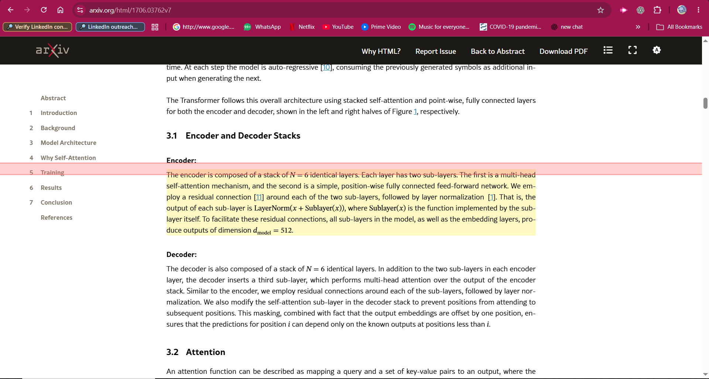
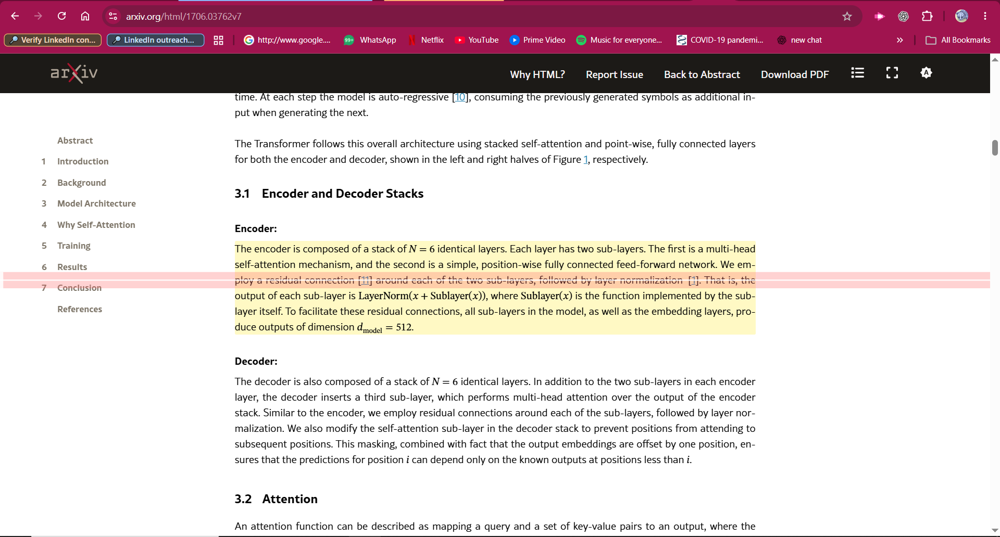
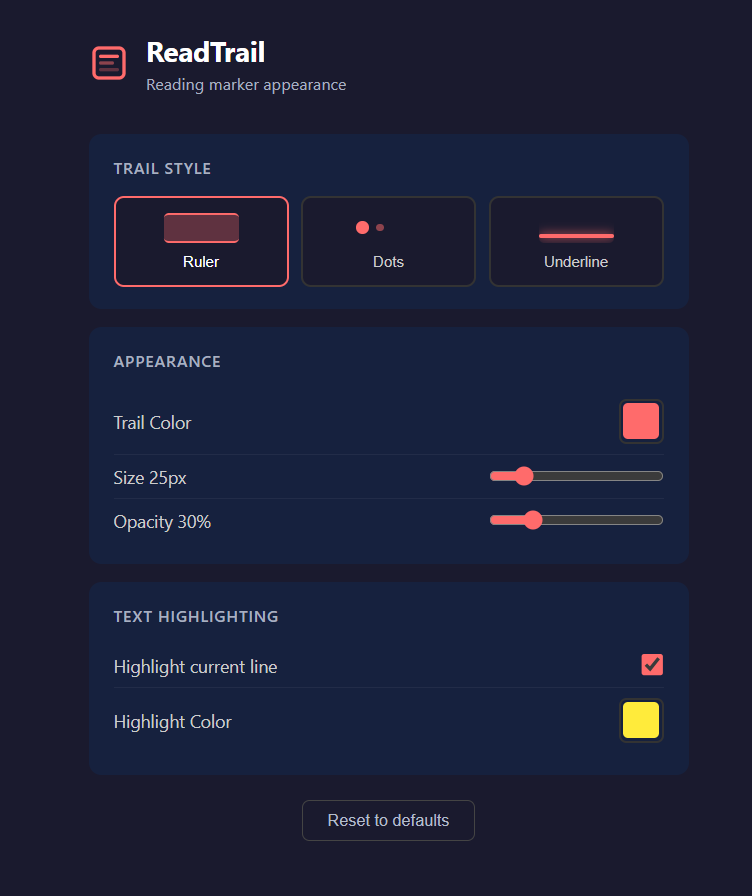
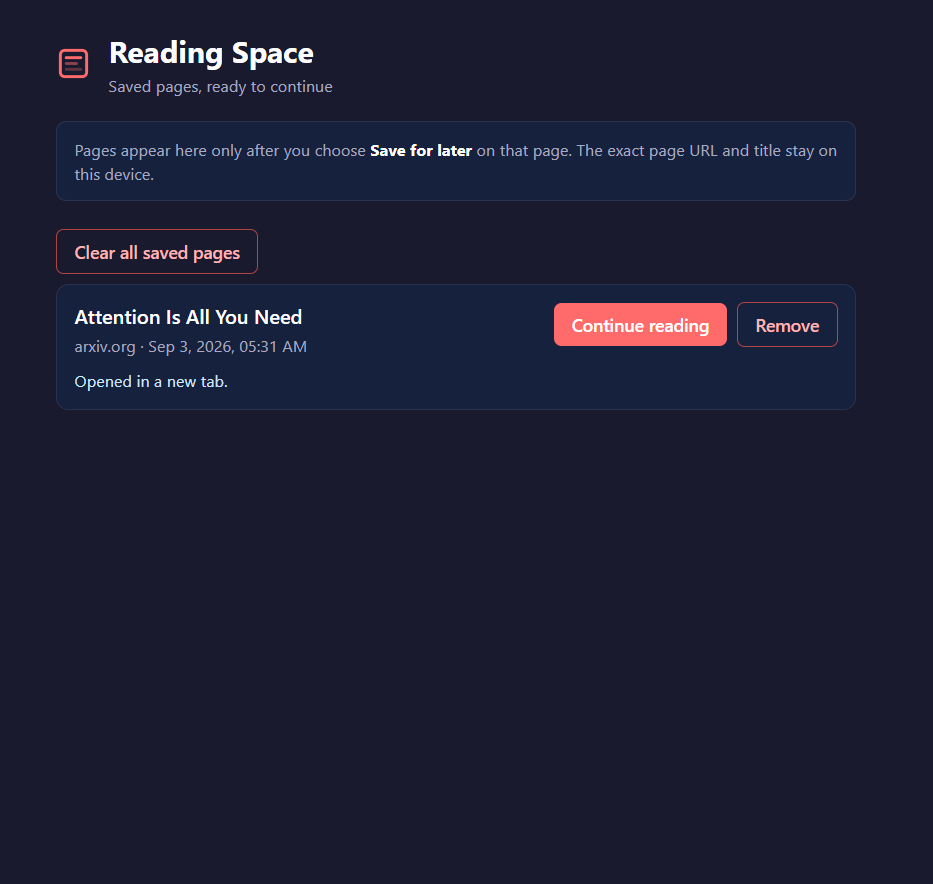

<div align="center">


<br/>


[](.)
[](.)
[](.)

</div>

<br/>

## 📖 What is ReadTrail?

**ReadTrail is a privacy-first Chrome reading companion that helps you follow the current line, pause on an exact place, and return to pages you intentionally save.**

It explores a simple product question:

> How can a browser help people continue reading without turning their attention into another data stream?

<div align="center">

> ⚡ **Status:** Working MVP. The reading guide, anchored pause points, explicit Save for later flow, persistent resume points, Reading Space, local preferences, and automated tests exist today.

</div>

<br/>

## ✅ What Works Today

<table>
<tr>
<td width="50%" valign="top">

- 🖊️ A visual guide that follows the current reading line
- 📍 A paused marker anchored to the selected text line while you scroll
- 🎨 Configurable trail styles, colors, size, opacity, and highlighting
- ⚙️ Explicit activation for the exact page you choose

</td>
<td width="50%" valign="top">

- 💾 Explicit **Save for later** with one persistent resume point per exact page URL
- 📚 A private Reading Space with Continue reading, Remove, and Clear all
- 📄 Continue reading opens the page, activates reading lock, and restores the saved position
- 🔒 Local-only settings and saved-page data—no account, analytics, or page-text collection
- 🧩 Manifest V3 Chrome extension architecture
- 🧪 128 automated behavioral tests with Vitest

</td>
</tr>
</table>

<br/>

## 📸 Screenshots

### Follow your place on long-form pages





### Customize the reading guide



### Return to saved reading



<br/>

## 🧭 Product Principles

| Principle | What it means |
|---|---|
| **Private by default** | Reading data stays on the device unless the user explicitly chooses otherwise |
| **Intentional activation** | The extension does not collect reading state before it's enabled for a page |
| **Useful, not distracting** | Controls disappear behind the reading experience |
| **Honest product boundaries** | Planned capabilities are documented separately from features already implemented |

📄 See **[Product Vision](docs/PRODUCT-VISION.md)** for the product direction, decisions, and open questions.

<br/>

## 🏗️ How It's Structured

```text
popup/       Quick controls
options/     Extension settings
content/     On-page reading experience
background/  Extension lifecycle and page state
reading-space/ Saved pages and resume actions
tests/       Behavioral tests
docs/        Product vision and engineering notes
```

The extension uses standard HTML, CSS, and JavaScript with Chrome Manifest V3 APIs. A canvas overlay renders the reading trail, while extension storage and background logic coordinate preferences and page state.

<br/>

## 🚀 Run It Locally

1. Clone or download this repository
2. Open `chrome://extensions` in Chrome
3. Enable **Developer mode**
4. Select **Load unpacked** and choose the project directory
5. Open a text-heavy page and activate ReadTrail from the extension popup
6. Move to a line and click once to pause the marker there
7. Choose **Save for later** in the popup when you want the place to survive a browser restart
8. Open **Reading Space** from the popup to continue or remove saved pages

After changing the source, you do not need to reinstall the extension: click **Reload** on the ReadTrail card in `chrome://extensions`, then refresh any page you want to test.

**Run the automated checks:**

```sh
npm install
npm test
```

<br/>

## 🗺️ Roadmap

- [x] Session restoration to the exact reading position on unchanged pages
- [x] Explicit Save for later with one durable resume point per exact URL
- [x] Private Reading Space for continuing and managing saved pages
- [x] Anchored paused markers that remain attached to their text while scrolling
- [ ] More resilient restoration when a page's structure changes significantly
- [ ] Optional save prompt when closing a tab with unsaved reading progress
- [ ] Reflection and knowledge connections built on top of reliable reading memory

> Roadmap items are planned work, not completed claims.

<br/>

## 💡 Why I Built This

ReadTrail is a product-engineering project focused on browser APIs, local-first state, interaction design, privacy constraints, and turning an ambiguous user problem into an incremental product roadmap. It's being built in public as part of my work across customer-facing AI and full-stack product engineering.

<br/>

## 📚 Development Notes

More detail on the development workflow is available in **[DEVELOPMENT.md](DEVELOPMENT.md)**.

<br/>

<div align="center">


</div>
